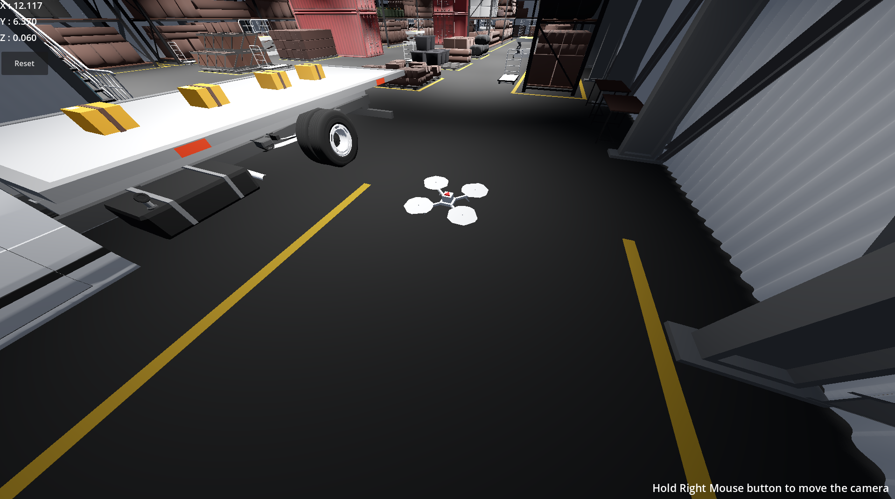
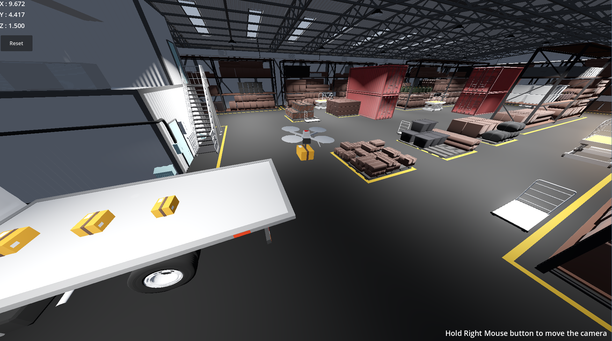
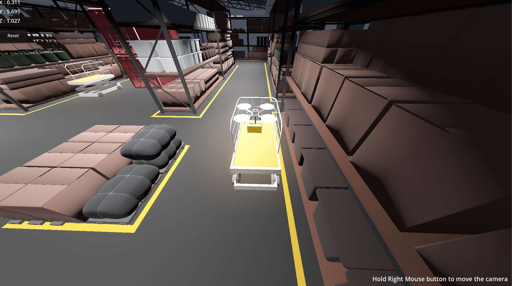

# LogiRotor

## Description
**LogiRotor** is a multirotor designed for optimizing package logistics within warehouse environments.
It is capable of transporting packages within the environment.
The project is related to the final exam for the course "Robotic Systems" held at the Department of Mathematics and Computer Science of the University of Catania by prof. Corrado Santoro.

## Tools

To simulate the drone and its environment, the software [Godot Engine](https://godotengine.org/) was chosen.  
For the management of the multirotor's dynamic system and its delivery instructions, Python scripts and Jupyter notebooks were created.  
The [course libraries](https://github.com/corradosantoro/RoboticSystems/tree/main/lib) were used to interface with the drone simulation via Godot using a publisher-subscriber architecture.

## Project Structure

- `config` contains the simulation configuration files:
  - *coordinates.csv*: contains the coordinates of the nodes in the drone path graph  
  - *edges.txt*: contains all the edges of the undirected graph  
  - *.json*: two files containing the multirotor instruction settings

- `docs` contains screenshots and an image representing the graph created
- `godot` contains all files related to the Godot scene, including the project file  
- `graphs` contains charts showing the drone’s position and speed along the trajectory (Virtual Robot technique)  
- `lib` contains the course libraries related to multirotor control via PID controllers
- `notebooks` contains a sample notebook for simulation and chart visualization  
- `src` contains the control and navigation logic of the multirotor:
  - *multirotor.py*: includes the model of a quadcopter with X-shaped configuration, including classes representing the robot's movements  
  - *path_planner.py*: includes the `Path_Planner` class responsible for creating a path for the robot based on the navigation graph, using shortest path algorithms
  - *control_system.py*: includes the `Control_System` class responsible for simulation and communication with Godot  
  - *courier.py*: includes the `Courier` class that orchestrates the various components for simulation  

## Execution

To run the project properly, **Godot 4.4.1** or higher is required.  
Make sure to create a virtual environment to install the required dependencies listed in `requirements.txt`, then clone the project:
After cloning the repository and installing the dependencies, run **Godot**, import the project file and execute the scene.
To run the simulation, execute `main.py`:
```bash
  python main.py
```

## Screenshots




## Authors

- [@eddy2809](https://www.github.com/eddy2809)
- [@weiss25r](https://www.github.com/weiss25r)

